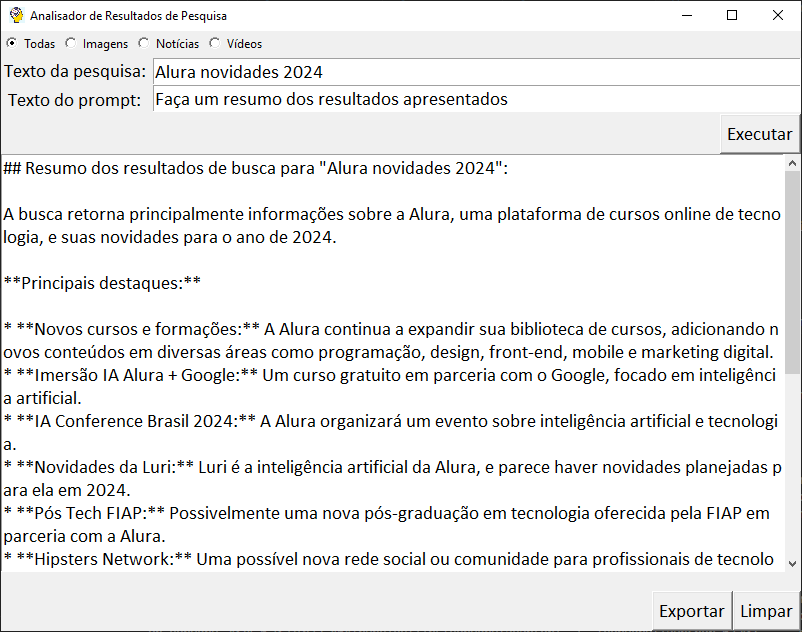
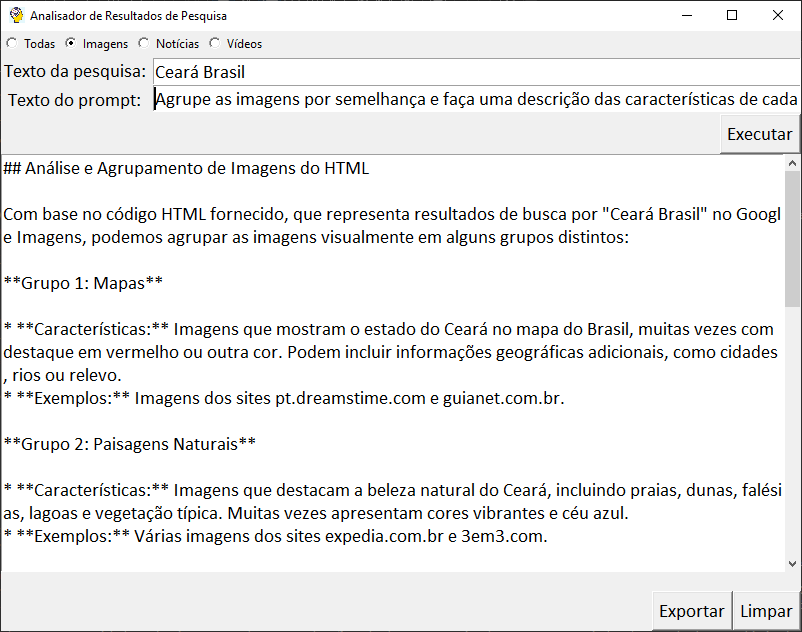
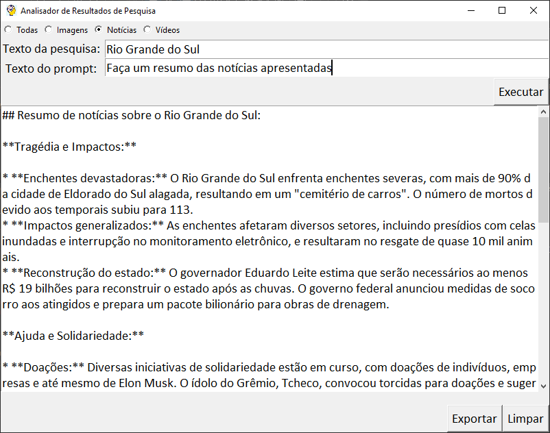
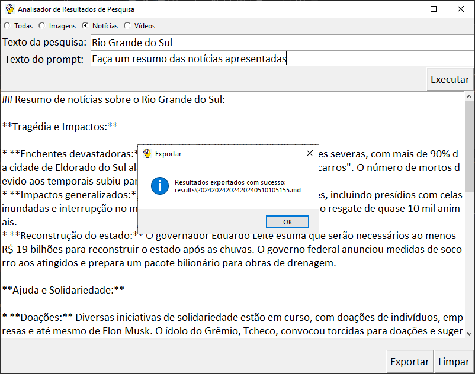
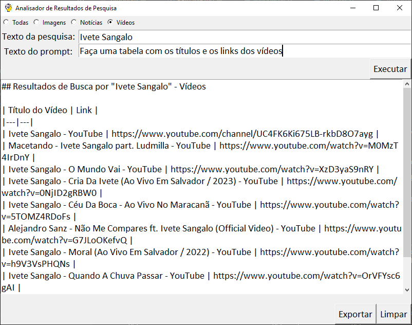
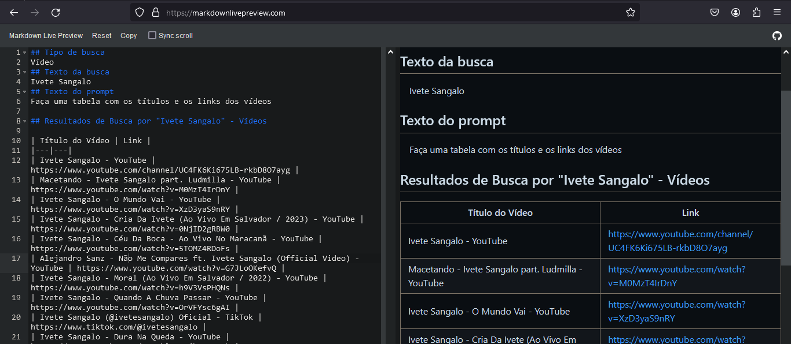

# Analisador de Resultados de Pesquisa
Ferramenta para analisar os resultados das pesquisas do Google utilizando Gemini AI. 
Projeto criado para o desafio da imersão IA Alura + Google

# Cenário
A maioria dos modelos de linguagem só possuem informações sobre eventos até a data que foram treinados.
Caso precisarmos solicitar para o modelo algum análise relacionado a fatos recentes, como notícias, eventos, atualizações, etc. o modelo não conseguirá retornar resultados válidos, respondendo que só possui informações até uma data específica.

# Solução proposta
A solução proposta através deste aplicativo é utilizar os resultados de uma pesquisa no buscador da Google como parte do prompt do modelo de linguagem, e com base nesse contexto solicitar uma análse pontual.

# Como usar
O aplicativo possui uma interface gráfica que permite o usuário definir as seguintes informações:
* **Tipo de pesquisa**: O usuário poderá escolher o tipo de pesquisa que deseja realizar no buscador do Google: todas, imagens, notícias ou vídeos
* **Texto da pesquisa**: Neste campo o usuário deverá escrever um texto para o qual deseja que o buscador da Google retorne resultados.
* **Texto do prompt**: Finalmente o usuário terá de escrever um prompt que deverá conter informações precisas do que se espera que o modelo retorne após realizar a análise.

# Exemplos de uso
## Exemplo 1
* Tipo selecionado: Todos
* Texto da pesquisa: "Alura novidades 2024"
* Texto do prompt: "Faça um resumo dos resultados apresentados"



## Exemplo 2
* Tipo selecionado: Imagens
* Texto da pesquisa: "Ceará Brasil"
* Texto do prompt: "Agrupe as imagens por semelhança e faça uma descrição de cada grupo"


(Observação: as imagens não são enviadas para o modelo, só a descrição inclusa no HTML)

## Exemplo 3
* Tipo selecionado: Notícias
* Texto da pesquisa: "Rio Grande do Sul"
* Texto do prompt: "Faça um resumo das notícias apresentadas"


Exportando resultados:


## Exemplo 4
* Tipo selecionado: Vídeos
* Texto da pesquisa: "Ivete Sangalo"
* Texto do prompt: "Faça uma tabela com os títulos e os links dos vídeos"


Visualizando os resultados exportados com um visualizador de markdown externo:


## Detalhes de implementação
### Requisições para o buscador da Google
O aplicativo utiliza a biblioteca 'requests' para enviar uma requisição para o buscador da Google, usando como base a seguinte url: 'https://www.google.com/search'.
O texto de busca é concatenado utilizando o caractere '+' e informado no parâmetro 'q'. Por fim é concatenado o parâmetro 'tbm' para definir um tipo de busca específico:
* ```tbm=isch``` imagens
* ```tbm=nws``` notícias
* ```tbm=vid``` vídeos

(Para o tipo "Todos" o parâmetro 'tbm' não é informado)

Exemplo de url:
```https://www.google.com/search?q=Cursos+Alura&tbm=nws```

### Criação do prompt para uso com o modelo
O texto do resultado da requisição é utilizado como parte do prompt da seguinte forma:

```full_prompt = search_results + context_text + prompt```

sendo:
* **full-prompt**: O prompt final que será utilizado com o modelo.
* **search_results**: O texto retornado pela requisição de busca.
* **context_text**: Uma constante contendo a seguinte frase: 'Baseado neste arquivo html com resultados de busca, '
* **prompt**: O texto do prompt introduzido pelo usuário através da interface

Exemplo de full-prompt:

```<!DOCTYPE html><html lang="pt-BR" ... [conteúdo retornado] - ... </html> Baseado neste arquivo html com resultados de busca, faça um resumo do conteúdo apresentado```


## Configuração
### Configurações do modelo
Em caso de precisar alterar alguma configuração do modelo os seguintes parâmetros estão disponíveis no arquivo 'src/config/model.py':

* **model_name**: Nome do modelo. Exemplo: "gemini-1.5-pro-latest"
* **generation_config**: Configuração da generação com parâmetros como temperatura, top_p, top_k e max_output_tokens.
* **safety_settings**: Configurações de segurança.


### Configurações do aplicativo
O aplicativo possui parâmetros de configuração que podem ser alterados no arquivo 'src/config/const.py':

* **font_type**: Tipo de fonte. Exemplo: 'Calibri'.
* **font_size**: Tamanho da fonte. Exemplo: 14
* **results_folder**: Pasta de resultados exportados. Exemplo: 'results'


## Instalação e execução
Para executar o aplicativo é necessário ter Python 3 instalado no computador. Como referência, o aplicativo foi desenvolvido usando Python 3.12.0.

* Abra o terminal do seu computador
* Posiciónese numa pasta da sua preferência
```
$ cd minha-pasta-de-projetos
```
* Faça o 'clone' do repositório:
```
$ git clone https://github.com/pablo-franco/analisador-resultados-pesquisa.git
```
* Posiciónese na pasta do projeto, criada automaticamente no passo anterior
```
$ cd analisador-resultados-pesquisa
```
* Faça a instalação das dependências
```
$ pip install -r requirements.txt
```
* Defina uma variável de ambiente com a apikey da Google (o nome da variável deve ser API_KEY)

Windows:
```
$ set API_KEY=cole-a-sua-apikey-aqui
```
Linux:
```
$ export API_KEY=cole-a-sua-apikey-aqui
```
* Execute o aplicativo
```
$ python .
```

## Evolução do aplicativo
Algumas ideias de evolução do aplicativo e/ou próximos passos

* Melhorar a área de visualização de resultado implementando suporte para formato markdown.
* Incluir um parâmetro configurável para definir a quantidade de resultados retornados.
* Incluir um combobox para escolher diferentes motores de busca.
* Possibilitar análise de conteúdo de outros sites, estáticos ou dinámicos.
* Possibilitar o upload das imagens retornadas pelo buscador para utilizar como prompt do modelo.
* Implementar embeddings para garantir que os resultados gerados sejam fiéis aos resultados retornados pelo buscador